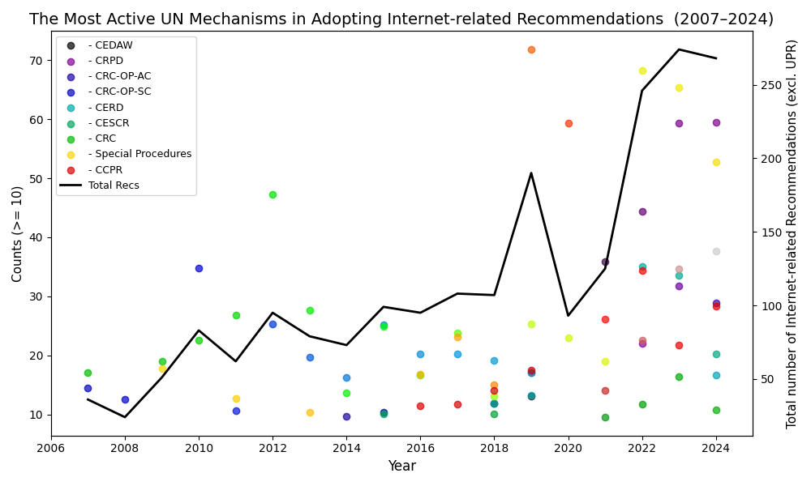
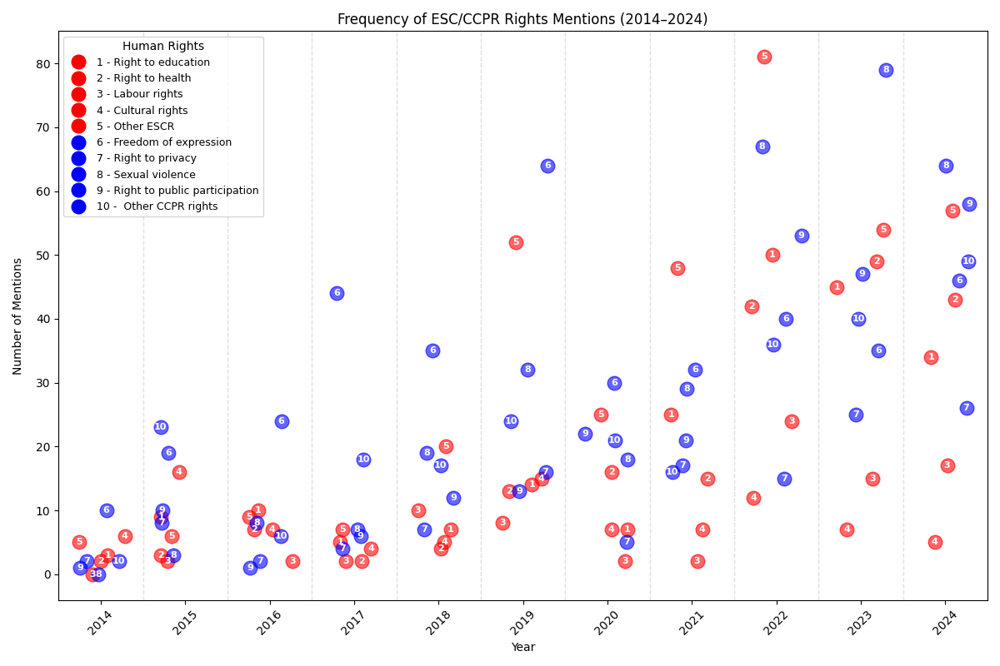
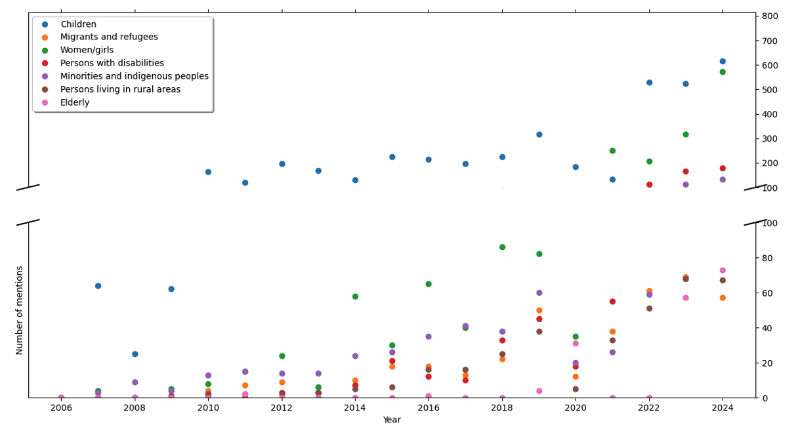
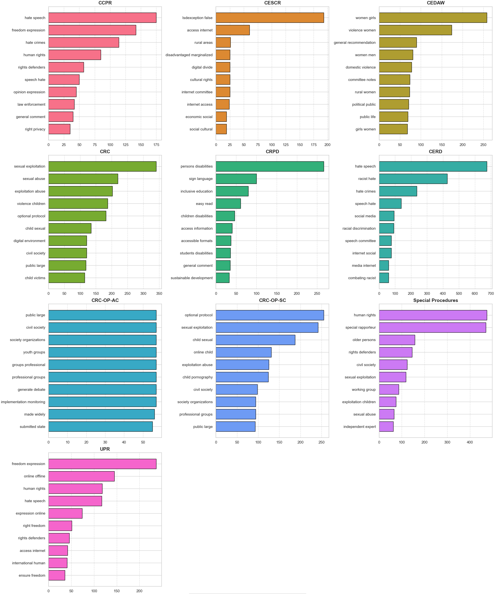

**UN Human Rights Analysis Workflow: Recommendations from Treaty Bodies, HRC Special Procedures, and the Universal Periodic Review**

This repository contains a collection of Python scripts designed to analyze data extracted from the <a href="https://uhri.ohchr.org/en">Universal Human Rights Index database</a> developed by the Office of the High Commissioner for Human Rights (OHCHR). The scripts are tailored to process and visualize UN recommendations from various sources, including the UN Treaty Bodies, the Human Rights Council (HRC) special procedures, and the Universal Periodic Review (UPR).

The dataset in the /Data directory is current as of 1 January 2025. For the most up-to-date UHRI dataset in JSON/Excel format <a href="https://uhri.ohchr.org/en/our-data-api">click here</a>.

**Overview of Scripts**

*1. Dataset_prep.py* 
Purpose: Data preprocessing
Key Features: Filtering entries based on specified keywords. Appending additional labels for "Special Procedures." Extracting publication years, and saving the processed data as a JSON file.

*2. General_trends.py* 
Purpose: Identifies and visualizes basic trends in data.
Key Features:
Focuses on general data trends over time: frequency of all/selected recommendations in the dataset; .
Supports graphical output for easy interpretation (line plot, stacked bar plot).

*3. Bodies_groups.py* 
Purpose: Analyzes recommendations from the perspectives of various UN mechanisms and/or concerned groups.
Key Features:
Enables comparisons across various bodies issuing recommendations or the groups to which they are directed.
Allows for the extraction and visualization of collocations (n-grams) highlighted by various UN mechanisms or in connection with specific concerned groups.

*4. ESC_CCPR_analysis.py* 
Purpose: Analyzes Economic, Social, and Cultural (ESC) rights and Civil and Political Rights (CCPR).
Key Features:
Generates plots with the most frequent/selected ESC and CCPR rights across time.
Allows for the comparison of ESC and CCPR rights across time (stacked bar).

*5. Rights_spider_plot_internet.py* 
Purpose: Creates spider plots for human rights, with a focus on selected rights.
Key Features:
Generates yearly and aggregated spider plots for visualizing the frequency of selected rights.
Uses radial scales tailored to specific time periods.
Provides a detailed breakdown of rights addressed.
 
*6. UPR_analysis.py* 
Purpose: Analyzes recommendations from the selected UN mechanism (e.g., Universal Periodic Review).
Key Features:
Filters recommendations based on specific themes and years.
Visualizes data using stacked bar charts.
Includes percentage-based annotations for clarity.

**Examples of Visualizations**

Below are some exemplary plots generated by the scripts in this repository. They have been generated on the /UHRI_Internet.json subset of the data available in the /Data directory. This subset includes 2,800 recommendations that mention one of the following words: *internet, online, digital.* 

Figure 1. The most active UN mechanisms (Treaty Bodies and HRC special procedures) in formulating Internet-related recommendations (2007 and 2024). Minimum threshold = 10 mentions (one of the following words: Internet, digital, online). The line indicates the total number of recommendations adopted by the UN Treaty Bodies and HRC special procedures. 

Figure 2. Frequency of selected civil and political and ESCR rights addressed in the Concluding Observations of the UN Treaty Bodies and reports of the HRC special procedures (2014-2024). 

Figure 3. Mentions of the concerned groups associated with limited Internet access, digital skills and challenges related to the digital environment between 2006 and 2024.  Please note that a break line on the Y axis was introduced for better readability.

Figure 4. Top 10 bigrams extracted from the recommendations of Treaty Bodies, HRC Special Procedures and UPR (2006-2024). Each bar represents the frequency of a specific bigram (two-word phrase) occurring in the recommendations issued by the respective mechanism. Y-axis represents the frequency of occurrence of each bigram within the recommendations.
